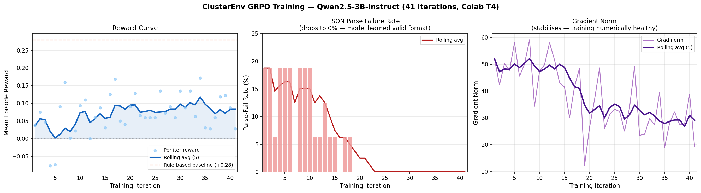

# ClusterEnv — Power-Capped AI Cluster Scheduling Under Information Asymmetry

**Theme:** Multi-Agent Interactions (Theme #1) — OpenEnv Hackathon Finale 2026

| | |
|---|---|
| **Environment Space** | [Mephisto2412/datacenter-env](https://huggingface.co/spaces/Mephisto2412/datacenter-env) |
| **Trained Adapter** | [Mephisto2412/clusterenv-grpo-adapter](https://huggingface.co/Mephisto2412/clusterenv-grpo-adapter) |
| **Training Notebook** | [train_grpo_colab.ipynb](training/train_grpo_colab.ipynb) |
| **Mini-Blog** | [BLOG.md](BLOG.md) |

---

## Training Results



*41 GRPO iterations on Colab T4. Left: reward (rolling avg in blue). Middle: JSON parse-failure rate — drops from 18.75% → 0%, proving the model learned structured output. Right: gradient norm stabilisation.*

Key numbers:
- Parse failures: **3/16 → 0/16** (100% reduction by iteration 16)
- Reward: **−0.08 → +0.10–0.17** (stable positive convergence)
- Rule-based baseline: **+0.28** (target for continued training)

---

An **OpenEnv-compliant reinforcement learning environment** for evaluating LLM agents on data centre cooling control. Built for the OpenEnv Hackathon — three progressively harder tasks challenge an agent to maintain thermal safety, minimise energy waste, and respond to realistic failures across a condensed 24-hour simulation.

---

## Table of Contents

1. [Problem Overview](#problem-overview)
2. [Architecture](#architecture)
3. [Tasks](#tasks)
   - [Easy: Single-Zone Thermal Runaway Recovery](#easy-single-zone-thermal-runaway-recovery)
   - [Medium: Multi-Zone Load Surge with Sensor Fault](#medium-multi-zone-load-surge-with-sensor-fault)
   - [Hard: Cascading Chiller Failure with Carbon-Aware Triage](#hard-cascading-chiller-failure-with-carbon-aware-triage)
4. [Physics Simulation](#physics-simulation)
5. [Timeline Condensation](#timeline-condensation)
6. [Observation Space](#observation-space)
7. [Action Space](#action-space)
8. [Reward Functions](#reward-functions)
9. [LLM Agent](#llm-agent)
10. [How to Run](#how-to-run)
11. [Known Caveats](#known-caveats)

---

## Problem Overview

A data centre generates continuous heat from IT equipment. Cooling systems (chillers, fans, supply air) must remove that heat while minimising power consumption (PUE) and carbon emissions. The challenge: cooling decisions have delayed thermal effects, equipment fails unexpectedly, and sensors can lie.

This environment does **not** train an RL agent. Instead, it provides a well-specified OpenEnv environment against which a frontier LLM can be evaluated zero-shot. Evaluators run `inference.py` against their model and score the episode outcomes.

**Scoring**: each task produces a final score in `[0.0, 1.0]`. The hackathon hard cap is **20 minutes total** inference time across all three tasks.

---

## Architecture

```
┌─────────────────────────────────────────────────────────────────────┐
│                         inference.py                                │
│  ┌────────────────┐   JSON prompt    ┌────────────────────────────┐ │
│  │  LLM Agent     │ ←──────────────→ │  OpenAI-compatible API     │ │
│  │  (Groq/Llama)  │                  │  (Groq llama-3.3-70b etc.) │ │
│  └───────┬────────┘                  └────────────────────────────┘ │
│          │ DCAction (JSON)                                           │
│          ▼                                                           │
│  ┌───────────────────────────────────────────────────────────────┐  │
│  │                     DCEnvironment                             │  │
│  │  ┌───────────────┐  ┌───────────────┐  ┌──────────────────┐  │  │
│  │  │  environment  │  │  simulation   │  │    graders/      │  │  │
│  │  │  .py          │→ │  .py          │  │  grader_easy.py  │  │  │
│  │  │               │  │               │  │  grader_medium.py│  │  │
│  │  │  TASK_CONFIGS │  │  FacilityState│  │  grader_hard.py  │  │  │
│  │  │  step()       │  │  ZoneState    │  │                  │  │  │
│  │  │  reset()      │  │  step_thermal │  │  step() reward   │  │  │
│  │  │  state()      │  │  advance_time │  │  final_score()   │  │  │
│  │  └───────────────┘  └───────────────┘  └──────────────────┘  │  │
│  └───────────────────────────────────────────────────────────────┘  │
│          │ DCObservation + reward                                    │
│          ▼                                                           │
│  ┌───────────────────┐                                              │
│  │  inference_output │  [START] / [STEP] / [END] protocol lines    │
│  │  .txt             │                                              │
│  └───────────────────┘                                              │
└─────────────────────────────────────────────────────────────────────┘

Data flow per step:
  LLM JSON action → DCAction (Pydantic) → SimDCAction
  → FacilityState.step() [thermal physics]
  → DCObservation built from FacilityState
    (includes active_alerts, chiller_fault_status computed by environment)
  → Grader.step() [reward calculation]
  → DCObservation.reward / .done set and returned to inference.py
  → formatted [STEP] line to stdout + log file
```

### Key files

| File | Role |
|------|------|
| `server/environment.py` | OpenEnv `Environment` subclass; orchestrates episodes, streaks, hard termination, observation building |
| `server/simulation.py` | Physics model: thermal mass, mass flow, chiller COP, free cooling, diurnal curves, sensor drift |
| `server/models.py` | Pydantic models: `DCObservation`, `ZoneObservation`, `DCAction`, `ZoneAdjustment`, `DCReward` |
| `server/scenarios/easy.py` | Easy scenario initial state builder |
| `server/scenarios/medium.py` | Medium scenario initial state builder with faulty sensor and diurnal outside temp curve |
| `server/scenarios/hard.py` | Hard scenario initial state builder with chiller fault injection and 24-hr weather/carbon curves |
| `server/graders/grader_easy.py` | Easy task reward logic |
| `server/graders/grader_medium.py` | Medium task reward logic |
| `server/graders/grader_hard.py` | Hard task reward logic |
| `inference.py` | Main runner: LLM API calls, alert injection, history enrichment, protocol output |
| `openenv.yaml` | OpenEnv manifest: task IDs, max_steps, descriptions |

---

## Tasks

### Easy: Single-Zone Thermal Runaway Recovery

```
┌─────────────────────────────────────────┐
│           Data Centre (Easy)            │
│                                         │
│  ┌───────────────────────────────────┐  │
│  │         zone_main                 │  │
│  │  Priority: MEDIUM                 │  │
│  │  IT load:  450 kW (steady)        │  │
│  │  Start T:  28.5 °C  ← OVERHEAT   │  │
│  │  Target:   [18 – 27 °C]           │  │
│  └───────────────────────────────────┘  │
│                                         │
│  Outside: 32 °C (hot summer afternoon)  │
│  Chiller: available, no faults          │
│  Grid:    medium carbon                 │
│  Time:    14:00 → 18:00 (4 hours)       │
└─────────────────────────────────────────┘

Episode: 20 steps × 12 min/step (step_scale=2.4)
```

**Goal**: Cool the overheating zone into `[18, 27]°C`, then maintain it efficiently — not just pin fans at 100% forever.

**Hard termination**: none.

**Final score**:
- 60% — fraction of steps where `cold_aisle_temp_c ∈ [18, 27]°C`
- 40% — average PUE improvement vs PID baseline

---

### Medium: Multi-Zone Load Surge with Sensor Fault

```
┌──────────────────────────────────────────────────────┐
│               Data Centre (Medium)                    │
│                                                       │
│  ┌────────────────────┐  ┌──────────────────────┐    │
│  │  zone_ai           │  │  zone_storage         │    │
│  │  Priority: CRITICAL│  │  Priority: MEDIUM     │    │
│  │  IT load: 600 kW   │  │  IT load: 200 kW      │    │
│  │  FAULTY SENSOR ⚠   │  │  (no fault)           │    │
│  │  sensor_confidence │  └──────────────────────┘    │
│  │  degrades 1.0→0.1  │                              │
│  │  by step ~10       │  ┌──────────────────────┐    │
│  └────────────────────┘  │  zone_infra           │    │
│                           │  Priority: LOW        │    │
│                           │  IT load: 150 kW      │    │
│                           └──────────────────────┘    │
│                                                       │
│  Outside: 18°C (night) → 34°C peak (noon)            │
│  Load surge: steps 6–17 (~60%→~95% of baseline)      │
│  Time: 06:00 → 18:00 (12 hours)                      │
└──────────────────────────────────────────────────────┘

Episode: 30 steps × 24 min/step (step_scale=4.8)
```

**Goal**: Keep all three zones in `[18, 27]°C` through a load surge while a faulty sensor on `zone_ai` reports up to 12°C above the true temperature. Agent must use `cold_aisle_temp_c` and `sensor_confidence` to infer true state.

**Hard termination**: any zone unsafe for 10+ consecutive steps → episode ends with score 0.

**Final score**:
- 35% — all-zone temperature compliance fraction
- 25% — average PUE improvement vs PID baseline
- 20% — sensor inference quality for `zone_ai` (did agent act on true state, not the faulty reading?)
- 20% — compliance fraction during peak load window (steps 6–17)

---

### Hard: Cascading Chiller Failure with Carbon-Aware Triage

```
┌──────────────────────────────────────────────────────────────┐
│                  Data Centre (Hard)                           │
│                                                               │
│  ┌─────────────────┐  ┌─────────────────┐                   │
│  │  zone_ai_1      │  │  zone_ai_2      │  ← CRITICAL        │
│  │  Priority: 2    │  │  Priority: 2    │    must stay        │
│  │  500 kW         │  │  480 kW         │    ≤ 30°C           │
│  └─────────────────┘  └─────────────────┘                   │
│                                                               │
│  ┌─────────────────┐  ┌─────────────────┐                   │
│  │  zone_storage   │  │  zone_infra     │  ← Sacrificeable   │
│  │  Priority: 1    │  │  Priority: 0    │    (LOW)            │
│  │  200 kW         │  │  120 kW         │                    │
│  └─────────────────┘  └─────────────────┘                   │
│                                                               │
│  Chiller fault timeline:                                      │
│    Step 0–2  : Normal operation (COP ≈ 3.5)                  │
│    Step 3    : COP begins degrading → 0.8 over 5 steps       │
│    Step 8    : Chiller OFFLINE — fans only from here         │
│    Steps 8–16: Recovery window (fans only; no free cooling)  │
│                                                               │
│  Starting conditions at 08:00 (already stressed):            │
│    IT loads at 90 %, zone temps 25–26 °C, outside ~20 °C    │
│    No free-cooling available — outside temp too warm         │
│                                                               │
│  Carbon: medium (08:00) → CRITICAL HIGH (10:00–16:00)        │
│          → medium/low (evening + overnight)                  │
│  Free cooling: only after ~22:00 when outside drops < 18 °C │
│  Time: 08:00 → 08:00+24h (full 24-hour simulated arc)        │
└──────────────────────────────────────────────────────────────┘

Episode: 40 steps × 36 min/step (step_scale=7.2)
```

**Goal**: Protect critical AI zones through a chiller failure starting during peak heat and load. Pre-cool before the fault, triage resources post-fault, and avoid running full fans during the high-carbon midday window. Free cooling is unavailable until late night (outside temp stays above 18°C through most of the episode).

**Hard termination**: any critical zone (`zone_ai_1` or `zone_ai_2`) above 32°C for 5+ consecutive steps → episode ends with score 0.

**Final score**:
- 30% — SLA compliance (critical zone safety throughout)
- 25% — carbon efficiency during high-carbon windows (steps ~11–22)
- 20% — recovery speed after chiller goes offline (steps 8–16)
- 15% — triage quality (protecting critical zones at expense of low-priority)
- 10% — reasoning coherence (stated reasoning matches actual action)

---

## Physics Simulation

All thermal physics live in `server/simulation.py`.

### Zone thermal model

Each `ZoneState` has a configurable thermal mass (`thermal_mass_kj_per_k`, default 850 kJ/K, scaled proportionally to zone IT load). The temperature update at each step is:

```
heat_in   = it_load_kw × SECONDS_PER_STEP (300 s)
heat_out  = mass_flow × Cp_air × (zone_temp - supply_air_temp)
ΔT        = (heat_in - heat_out) × SECONDS_PER_STEP / (thermal_mass_kj_per_k × 1000)
zone.temp += ΔT
```

Where `mass_flow` scales with `fan_speed_pct` and zone capacity:

```
mass_flow = (fan_speed_pct / 100) × MASS_FLOW_REF_KGS × (capacity_ratio)
capacity_ratio = zone.cooling_capacity_kw / MASS_FLOW_REF_CAPACITY_KW
```

The cold-aisle temperature floor is clamped to prevent physically impossible sub-ambient values.

### Chiller and free cooling

- **Chiller COP** is temperature-dependent: warmer outside air reduces efficiency. COP degrades as `outside_temp_c` rises (approx. linear from 3.5 at 20°C to lower values at 35°C).
- **Free cooling** (`free_cooling_potential`) measures how much cooling could be supplied by outside air economiser. Active only when `wet_bulb_temp_c` is meaningfully below target supply temperature. The chiller propagation logic blends free-cooling air only when it is genuinely cooler than the chilled-water target.
- **Chiller fault** (hard scenario): `chiller_fault_step` triggers COP degradation over 5 steps, followed by full offline state. Detectable via `chiller_fault_status` field in observation: `"nominal"` → `"degrading"` → `"offline"`. The legacy `chiller_fault_detected` bool remains for backward compatibility.

### Diurnal curves

Medium and hard scenarios provide per-step outside temperature and wet-bulb curves (144 and 288 raw data points respectively). The environment uses `step_scale` to index into these curves at the correct condensed rate (see [Timeline Condensation](#timeline-condensation)).

IT load follows a 24-hour sinusoidal/trapezoidal profile. Carbon intensity follows a separate 24-hour curve with peak midday values.

### Sensor drift (medium scenario)

`zone_ai` has a sensor fault. The `apply_sensor_drift()` method in `FacilityState` accumulates drift using an effective step count scaled by `minutes_per_step / 5.0`:

```
effective_step = raw_step × (minutes_per_step / 5.0)
target_drift   = min(3.0 + effective_step × 0.18, 12.0)  # caps at +12°C
```

`reported_temp_c` includes this drift. `sensor_confidence` degrades from 1.0 → ~0.1 as drift accumulates. For zones with an active sensor fault, **`cold_aisle_temp_c` in the observation also reflects the faulty (drifted) sensor reading** — it is no longer ground truth. Only `hot_aisle_temp_c` and `supply_air_temp_c` remain accurate and can be used to infer the true thermal state.

### Rate limiting on actions

`simulation.step()` applies soft rate limiting: consecutive large fan speed or setpoint changes are partially smoothed to prevent instantaneous step changes that would be physically unrealistic.

---

## Timeline Condensation

The original scenario plans span 48 / 144 / 288 steps at 5 min/step (4 / 12 / 24 hours). To fit within the ~20-minute inference budget, episodes are condensed:

| Task | Original steps | Condensed steps | `step_scale` | Sim time per step | Total simulated time |
|------|---------------|-----------------|--------------|-------------------|----------------------|
| Easy | 48 | 20 | 2.4 | 12 min | 4 hr |
| Medium | 144 | 30 | 4.8 | 24 min | 12 hr |
| Hard | 288 | 40 | 7.2 | 36 min | 24 hr |

**How it works**: `minutes_per_step = 5.0 × step_scale` is stored in `FacilityState`. Each environment step:

1. **Clock** advances by `minutes_per_step` (e.g. 36 min for hard task).
2. **Weather curves** are indexed at `step_count × step_scale` to traverse the full arc.
3. **Load and carbon curves** follow the clock (hour-indexed), so they also advance at the right rate.
4. **Sensor drift** uses `effective_step = raw_step × step_scale` so drift speed is proportionally correct.
5. **Chiller fault step** is rescaled on `reset()`: `scaled_fault = round(raw_fault_step / step_scale)`.
6. **Thermal physics** (`step_thermal()`) still use `SECONDS_PER_STEP = 300` (5 real minutes) to maintain physically accurate heat transfer calculations.

The result: the agent experiences the full scenario arc (night → morning surge → peak → recovery) within a tractable step count, while individual cooling physics remain realistic.

---

## Observation Space

Returned as a `DCObservation` Pydantic model each step. All fields are present for all tasks.

### Facility-level fields

| Field | Type | Description |
|-------|------|-------------|
| `step` | `int` | Current step number (0-indexed after first step) |
| `timestamp_hour` | `float` | Hour of day [0–24] (advances by `minutes_per_step / 60` per step) |
| `timestamp_day_sin` | `float` | sin(2π × hour/24) — cyclical time encoding |
| `timestamp_day_cos` | `float` | cos(2π × hour/24) — cyclical time encoding |
| `outside_temp_c` | `float` | Outdoor dry-bulb temperature (°C) |
| `wet_bulb_temp_c` | `float` | Outdoor wet-bulb temperature (°C) — determines free-cooling potential |
| `chiller_active` | `bool` | Whether the chiller is currently running |
| `chiller_setpoint_c` | `float` | Current chilled-water setpoint [6–15] (°C) |
| `chiller_cop` | `float` | Current chiller coefficient of performance |
| `chiller_fault_detected` | `bool` | Observable anomaly: True when COP < 60% of baseline or chiller is offline |
| `chiller_fault_status` | `str` | Three-state chiller health: `"nominal"` / `"degrading"` / `"offline"`. When `"offline"`, `chiller_active=true` in actions is silently ignored by the environment |
| `ups_efficiency` | `float` | UPS efficiency [0–1] |
| `current_pue` | `float` | Real-time Power Usage Effectiveness (1.0 = perfect) |
| `free_cooling_potential` | `float` | Fraction of cooling that could be met by free-air economiser [0–1] |
| `grid_carbon_intensity` | `str` | Human-readable label: `low`, `medium`, `high`, `critical_high` |
| `carbon_intensity_normalized` | `float` | Numeric carbon intensity [0.0–1.0] |
| `load_curve_phase` | `str` | Diurnal phase: `ramp_up`, `peak`, `ramp_down`, or `idle` |
| `sla_violation_streak` | `int` | Consecutive steps where any zone was outside [18, 27]°C |
| `maintenance_active` | `bool` | True if any zone is in a maintenance window |
| `maintenance_notes` | `list[str]` | Free-text maintenance notes (also used for system feedback, e.g. "ACTION IGNORED: chiller already offline") |
| `upcoming_events` | `list[str]` | Scenario-injected event forecasts |
| `active_alerts` | `list[str]` | Environment-computed structured alerts at each step. Covers: chiller fault/offline, zone overheating/overcooling, sensor faults, near-boundary warnings, efficiency hints, SLA streaks. Agents should act on these before inspecting raw numeric fields |
| `history` | `list[dict]` | Last 3 step snapshots (per-zone temps, fan speed, PUE) — oldest first. For sensor-faulty zones, records the drifted reading, consistent with the observation |

### Per-zone fields (`zones` array)

Each entry in `zones` is a `ZoneObservation`:

| Field | Type | Description |
|-------|------|-------------|
| `zone_id` | `str` | Zone identifier (e.g. `zone_main`, `zone_ai_1`) |
| `cold_aisle_temp_c` | `float` | Primary cold-aisle sensor reading (°C). For zones with `sensor_confidence < 0.7` this value **reflects the faulty sensor** and may be drifted up to +12°C above true temperature. Not ground truth for faulty zones |
| `hot_aisle_temp_c` | `float` | Return-air temperature from server exhausts (°C). **Always accurate** — unaffected by sensor faults |
| `reported_temp_c` | `float` | Secondary sensor reading (°C). Cross-checking `cold_aisle_temp_c` vs `reported_temp_c` plus hot-aisle physics can reveal sensor drift |
| `supply_air_temp_c` | `float` | Actual delivered supply air temperature after chiller blending (°C) |
| `supply_air_temp_setpoint_c` | `float` | Agent-controlled supply air temperature setpoint [16–26] (°C) |
| `it_load_kw` | `float` | Current IT equipment power draw (kW) |
| `it_load_pct` | `float` | Normalised IT load relative to zone baseline [0–1] |
| `fan_speed_pct` | `float` | Current fan speed [0–100%] |
| `cooling_capacity_kw` | `float` | Maximum cooling capacity at full fan speed (kW) |
| `humidity_pct` | `float` | Relative humidity (%) |
| `sensor_confidence` | `float` | Reliability weight [0.0–1.0]; below 0.5 means `reported_temp_c` is unreliable |
| `zone_priority` | `int` | Static criticality: 0=LOW, 1=MEDIUM, 2=CRITICAL |
| `load_forecast_next_hour` | `float` | Predicted IT load 60 min ahead (kW), computed from load curve |

### Active alerts (`active_alerts` field)

`active_alerts` is a first-class field of `DCObservation`, computed by the environment at each step via `_compute_active_alerts()`. It is part of the observation spec and available to any client — not just `inference.py`.

Alert categories:
- **Chiller**: `CRITICAL: Chiller is OFFLINE` (with explicit note that `chiller_active=true` is ignored) or `WARNING: Chiller is DEGRADING (COP=X.XX)`
- **Zone violations**: `VIOLATION: zone_id OVERHEATING at X.X°C` or `OVERCOOLING`
- **Near-boundary**: `WARNING: zone_id at X.X°C — within 1°C of limit`
- **Sensor fault**: `SENSOR FAULT: zone_id sensor_confidence=0.XX — reading may be off by ~X.X°C`
- **Carbon**: `CARBON CRITICAL (0.XX): Grid at peak emissions`
- **SLA streak**: `SLA ALERT: N consecutive violation steps. Hard termination triggers at 10`
- **Efficiency**: `EFFICIENCY: zone_id stable at X.X°C with fan at X% — reduce to 45–65%`

---

## Action Space

Submitted as a `DCAction` JSON object each step.

### Per-zone adjustments (`zone_adjustments` array)

| Field | Type | Bounds | Description |
|-------|------|--------|-------------|
| `zone_id` | `str` | — | Must exactly match a `zone_id` from the current observation |
| `fan_speed_pct` | `float` | [0.0, 100.0] | Target fan speed for this zone |
| `supply_air_temp_setpoint_c` | `float` | [16.0, 26.0] | Target supply air temperature setpoint |

### Facility-level controls

| Field | Type | Bounds | Default | Description |
|-------|------|--------|---------|-------------|
| `chiller_setpoint_c` | `float` | [6.0, 15.0] | 10.0 | Facility-wide chilled-water supply temperature setpoint |
| `chiller_active` | `bool` | — | true | Toggle chiller on/off |
| `reasoning` | `str` | — | null | Agent's explanation; graded in hard task for coherence |

**Rate limiting**: the simulation smooths abrupt consecutive changes to fan speed and setpoint. Limits scale proportionally with `minutes_per_step` so they remain physically consistent across tasks — at 36 min/step (hard task) the effective limit is 7.2× the base value, allowing meaningful single-step changes that would take multiple steps at 5 min/step.

**Omitting a zone** from `zone_adjustments` leaves its settings unchanged for that step.

---

## Reward Functions

All rewards are per-step values clipped to `[-1.0, 1.0]`. The grader also produces a `final_score` in `[0.0, 1.0]` at episode end.

### Easy task (`grader_easy.py`)

**Per-step reward** (`R_step`):

```
If zone in [18, 27]°C:
  closeness       = 1.0 - |temp - 22| / 5.0                   (0→1)
  dist_boundary   = min(temp - 18, 27 - temp)
  boundary_margin = min(dist_boundary / 3.0, 1.0)             (0→1)
  temp_reward     = 0.30 + 0.10×closeness + 0.15×boundary_margin
  streak_bonus    = 0.05 × min(consecutive_safe / 10, 1.0)
  temp_reward     = min(0.60, temp_reward + streak_bonus)

  pue_vs_pid  = (pid_baseline_pue - current_pue) / (pid_baseline_pue - 1.18)
  pue_reward  = 0.35 × pue_vs_pid  (clamped to [-1, 1])

Else (violation):
  overshoot   = max(0, temp - 27)
  undershoot  = max(0, 18 - temp)
  temp_reward = -0.30 × min((overshoot + undershoot) / 3.0, 1.0)
  pue_reward  = 0.0   (suppressed during violation)

carbon_reward = -0.05 × (cooling_overhead_fraction) × carbon_normalized

R_step = clip(temp_reward + pue_reward + carbon_reward, -1, 1)
```

**Final score**: `0.60 × compliance_fraction + 0.40 × avg_pue_score`

---

### Medium task (`grader_medium.py`)

**Per-step reward weights**: temp=0.45, PUE=0.25, carbon=0.15, roughness=0.10, sensor=0.05

The sensor weight (0.05) provides a small per-step signal aligned with the final score's 20% sensor quality component. It is active from the moment a supply error is detectable for `zone_ai`.

Priority multipliers on temperature reward: LOW=0.7×, MEDIUM=1.0×, CRITICAL=1.4×

**Sensor inference quality**: scored at episode end by comparing agent's `supply_air_temp_setpoint_c` for `zone_ai` against an oracle setpoint (20°C during high load, 22°C normal). Averaged over steps when `sensor_confidence < 0.5`. Rewards agents that use the true physical temperature rather than the drifted sensor reading.

**Final score**:
```
0.35 × all_zone_compliance
+ 0.25 × avg_pue_score
+ 0.20 × sensor_inference_quality
+ 0.20 × peak_window_compliance  (steps 6–17)
```

---

### Hard task (`grader_hard.py`)

**Per-step reward weights**: temp=0.45, PUE=0.20, carbon=0.05, safety=0.20, roughness=0.05, stability=0.05

**SLA compliance**: critical zones (`zone_ai_1`, `zone_ai_2`) above `CRITICAL_THRESHOLD=30°C` incur hard safety penalties. Above `EMERGENCY_THRESHOLD=35°C` = maximum penalty.

**Triage quality**: measured post-fault. At each step after `CHILLER_OFFLINE_STEP=8`, checks whether critical zones are being prioritised (higher fan, lower setpoint) relative to low-priority `zone_infra`.

**Recovery speed**: fraction of steps in the recovery window `[8, 16]` where all critical zones are in safe band `[18, 27]°C`.

**Carbon efficiency**: normalised against a passive baseline of 70% average fan speed. Score = `(0.70 − avg_cooling_proxy) / (0.70 − 0.20)`, clamped to [0, 1]. A frozen agent running fans at ~70% scores 0.0; an agent that reduces cooling during high-carbon windows scores up to 1.0. Defaults to 0.5 if the episode ends before any high-carbon window is reached.

**Reasoning coherence**: regex-scored against declared crisis actions. An agent saying "raising fans to protect critical zones" that actually lowers fans loses coherence points.

**Final score**:
```
0.30 × sla_score
+ 0.25 × carbon_score
+ 0.20 × recovery_score
+ 0.15 × triage_score
+ 0.10 × reasoning_score
```

**Hard termination**: if `chiller_active=False` is observed while episode is not done, and any critical zone exceeds 32°C for 5+ consecutive steps, the episode terminates immediately with `score=0`.

---

## LLM Agent

The agent in `inference.py` makes one API call per step and formats its response as JSON.

### System prompt structure

The system prompt (constant across all steps and tasks) teaches the agent:

1. **MDP structure**: state fields, action fields, reward shaping goals.
2. **Decision rules** (priority order): safety → efficiency → carbon.
3. **Zone control rules**: when to go aggressive (temp > 27°C), when to back off (temp falling toward 18°C), thermal inertia awareness.
4. **Sensor confidence rule**: `sensor_confidence < 0.7` → `cold_aisle_temp_c` may be drifted. Below 0.5, neither cold-aisle field is trustworthy — infer true thermal state from `hot_aisle_temp_c` (always accurate), `supply_air_temp_c`, and `it_load_kw`.
5. **Chiller failure protocol**: check `chiller_fault_status` every step. On `"degrading"`: pre-cool immediately. On `"offline"`: triage with fans only; `chiller_active=true` is explicitly ignored by the environment (confirmed via `maintenance_notes`).
6. **Triage rule**: zone priorities (2=CRITICAL, 1=MEDIUM, 0=LOW) and when to sacrifice low-priority zones.

### Per-step user message

Each step, the agent receives:

- Full current `DCObservation` as JSON (including `active_alerts` and `chiller_fault_status`)
- Enriched history entries tagged with events (e.g. `[CHILLER_FAULT]`, `[CHILLER_OFFLINE]`, `[VIOLATION:zone_id]`) for temporal context

### Fallback mechanism

If the LLM API call fails (network error, rate limit), the agent uses a two-tier fallback:

1. **`_last_llm_result`** — if a prior LLM response exists, it is replayed as the action for this step.
2. **`_safe_mode_action(obs)`** — if no prior LLM response exists, a conservative safe-mode action is generated: all zone fans at 85%, supply setpoint 18°C, chiller active only if `chiller_fault_status != "offline"`. This avoids the failure mode of attempting to re-enable a dead chiller.

### Daily token quota (TPD) handling

When Groq returns a `RateLimitError` containing "per day" or "TPD", the retry logic immediately returns `{}` (empty action → fallback) rather than sleeping for minutes. This avoids wasting wall-clock budget on a quota that cannot recover mid-run.

### Rate limit retry

On transient per-minute 429 errors: exponential backoff with `base=2.0s`, doubling per attempt, max 3 attempts (2s → 4s → 8s = 14s max).

### Model and API configuration

```bash
export OPENAI_API_KEY="your-groq-key"
export API_BASE_URL="https://api.groq.com/openai/v1"   # default
export MODEL_NAME="llama-3.3-70b-versatile"            # default
export VERBOSE=1                                        # show INFO lines
```

---

## How to Run

### Prerequisites

```bash
pip install openenv openai pydantic
```

### Start the environment server (if using OpenEnv server mode)

```bash
cd datacenter-env
python -m openenv.server --env server.environment:DCEnvironment
```

### Run inference directly (recommended for hackathon evaluation)

```bash
export OPENAI_API_KEY="your-api-key"
export API_BASE_URL="https://api.groq.com/openai/v1"
export MODEL_NAME="llama-3.3-70b-versatile"

cd datacenter-env
python inference.py
```

Output is written to both **stdout** and **`inference_output.txt`**.

Protocol lines printed:
```
[START] task=easy-single-zone env=dc-openenv model=llama-3.3-70b-versatile
[STEP]  step=1 action={...} reward=0.42 done=false error=null
...
[END]   success=true steps=20 score=0.71 rewards=0.42,0.55,...
```

### Per-task step cap (optional override)

```bash
export INFERENCE_MAX_STEPS_PER_TASK=10
python inference.py
```

### Run a single task programmatically

```python
from server.environment import DCEnvironment
from server.models import DCAction, ZoneAdjustment

env = DCEnvironment(task="easy-single-zone")
obs = env.reset()   # returns DCObservation directly

# Build a DCAction and step
action = DCAction(
    zone_adjustments=[ZoneAdjustment(zone_id="zone_main", fan_speed_pct=70.0, supply_air_temp_setpoint_c=20.0)],
    chiller_setpoint_c=10.0,
    chiller_active=True,
    reasoning="Moderate cooling to recover from overheat"
)
obs = env.step(action)   # returns DCObservation with .reward and .done set
print(obs.reward, obs.done, obs.chiller_fault_status)
print(obs.active_alerts)  # environment-computed alerts for this step
```

---

## Known Caveats

### Thermal-time disconnect
The physics engine always uses `SECONDS_PER_STEP = 300` (5 real minutes) for heat transfer calculations. With `step_scale > 1`, the simulated clock advances faster than the thermal equations assume. This means temperatures change more slowly per step than they would in a true high-speed simulation. The effect is intentional — it keeps individual temperature steps manageable — but it means a zone in the hard task at step_scale=7.2 may appear thermally stable even as the clock jumps 36 minutes.

### Easy task flat load
The easy scenario uses a constant IT load of 450 kW throughout. There is no diurnal variation. The full `_default_load_curve` is loaded but the scenario's single zone has a constant `base_it_load_kw`, so the curve has no practical effect. The challenge is purely thermal recovery and PUE optimisation.

### Sensor fault is one-directional
The medium task's sensor fault only drifts upward (reports higher than true). A naive agent that trusts the drifted `cold_aisle_temp_c` will over-cool. The intended recovery path is `sensor_confidence < 0.5` → cross-check against `hot_aisle_temp_c` and `supply_air_temp_c` to estimate the true thermal state.

### Chiller cannot be re-enabled mid-episode (hard task)
Once `chiller_fault_step` triggers and the chiller goes offline, setting `chiller_active: true` in the action has no effect — the simulation ignores it. The agent must survive on fans and free cooling alone from step 8 onward. The system prompt warns the agent of this, but LLMs that ignore the protocol may waste steps attempting to re-enable the chiller.

### LLM thermal inertia blindspot
Zero-shot LLMs often react too late to temperature trends. The environment's `boundary_margin` reward component and the system prompt's thermal inertia guidance both try to mitigate this. The `active_alerts` efficiency nudge also pushes back when fans are high on an already-cool zone. These are heuristic measures; a well-fine-tuned agent would outperform a zero-shot one significantly.

### Success thresholds
Per-task success thresholds are calibrated to each difficulty:
- Easy: ≥ 0.55
- Medium: ≥ 0.50
- Hard: ≥ 0.40

These are lower than 0.6 for harder tasks because the scenario's physical difficulty (cascading failure, faulty sensor) genuinely limits achievable scores for a zero-shot agent.
